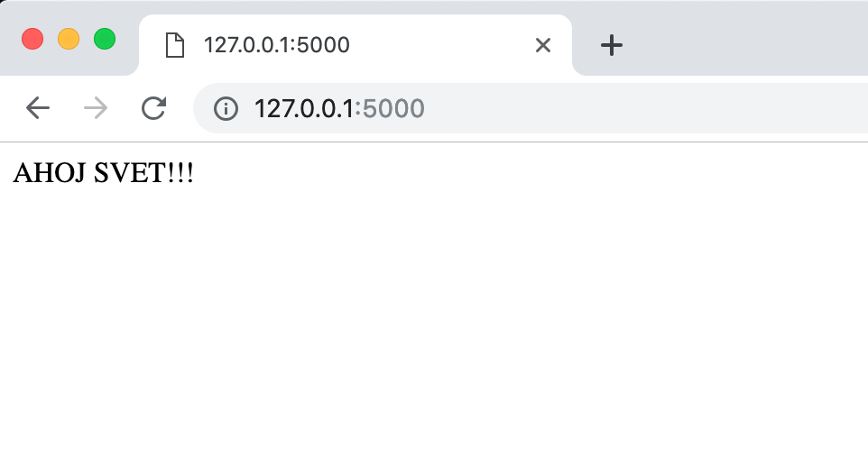
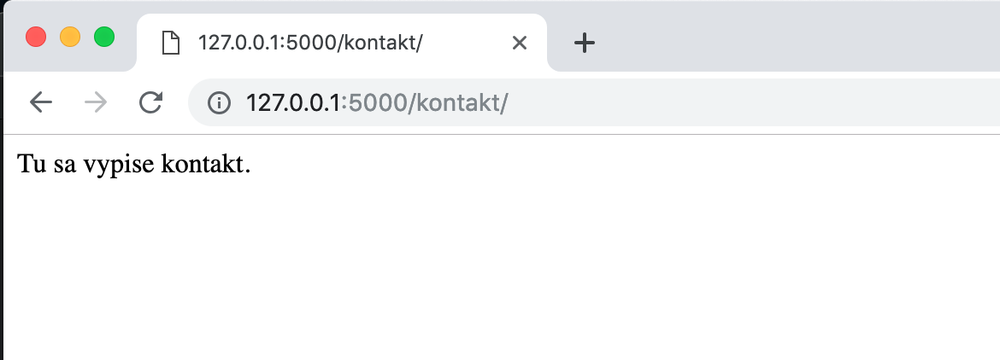
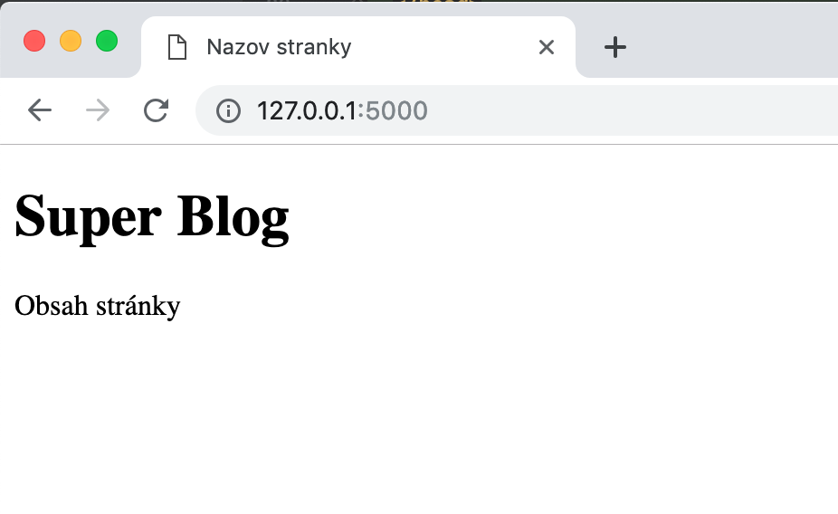
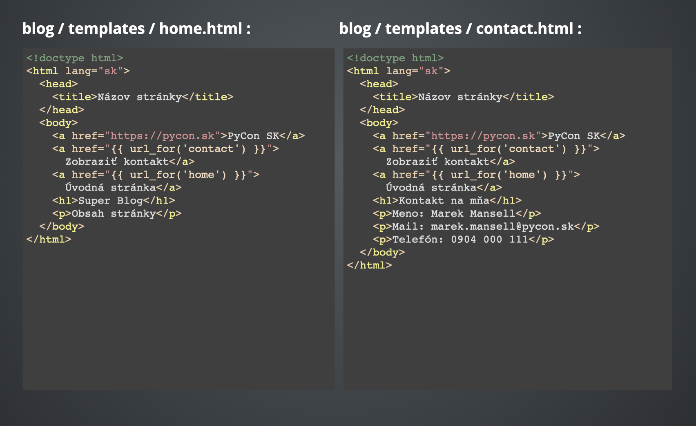
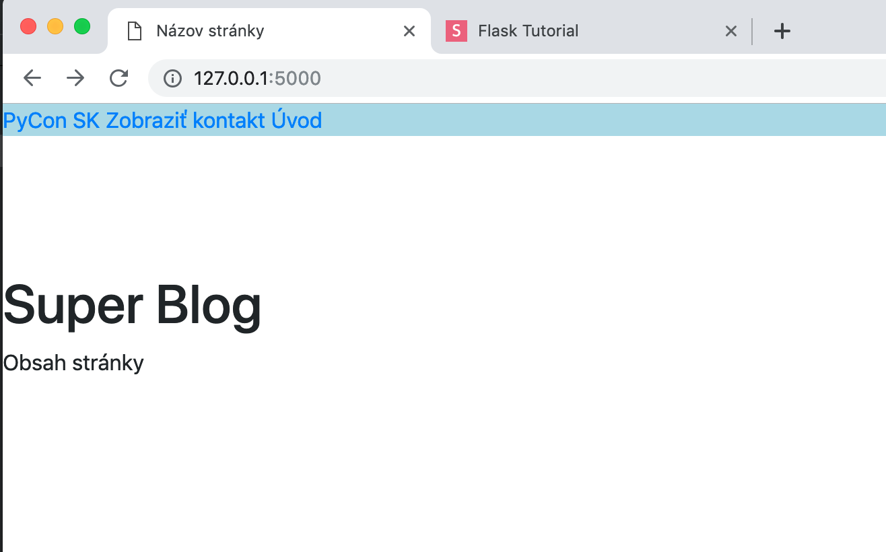

## Simple flask template

__1. Create blog.py file:__

blog/blog.py
```python
from flask import Flask
app = Flask(__name__)

@app.route("/")
def home():
    return "Holla Planet!"
```

__2. Run a flask app (inside the blog dir)__ 

Unix Bash (Linux & MacOS):
```
$ export FLASK_APP=blog.py
$ export FLASK_ENV=development
$ flask run
```
Windows CMD:
```
> set FLASK_APP=blog.py
> set FLASK_ENV=development
> flask run
```
Windows PowerShell:
```
> $env:FLASK_APP = "blog.py"
> $env:FLASK_ENV = "development"
> flask run
```

In browser: 127.0.0.1:5000



__3. Sending some HTML__

blog/blog.py
```python
from flask import Flask
app = Flask(__name__)

@app.route("/")
def home():
    return "<h1>Super Blog</h1>"
```

__4.__

blog/blog.py
```python
from flask import Flask

app = Flask(__name__)

@app.route("/")
def home():
    return "<h1> SUPER BLOG </h1>"\

@app.route("/kontakt/")
def contact():
    return "Tu sa vypise kontakt."
```




__5. Templates(šablóny)__

Create `templates` folder with `home.html` file

```
blog
├── blog.py
└── templates
    └── home.html
```

blog/templates/home.html
```html
<!doctype html>
<html lang="sk">
  <head>
    <title>Názov stránky</title>
  </head>
  <body>
    <h1>Super Blog</h1>
    <p>Obsah stránky</p>
  </body>
</html>
```

blog/blog.py
```python
from flask import Flask, render_template
app = Flask(__name__)

@app.route("/")
def home():
    return render_template('home.html')

@app.route("/kontakt/")
def contact():
    return "Tu sa vypíše kontakt"

```



__6. HTML template for /kontakt/__

blog/templates/contact.html
```html
<!DOCTYPE html>
<html lang="en">
<head>
    <meta charset="UTF-8">
    <title>Title</title>
</head>
<body>
    <h1>Kontakt na mna</h1>
    <p>Meno: Juraj Klucka</p>
    <p>Mail: juraj.klucka@pycon.sk</p>
    <p>Telefon: 0903 000 000</p>
</body>
</html>
```

blog/blog.py
```python
@app.route("/kontakt/")
def contact():
    return render_template('contact.html')
```

__7. Links (odkazy)__

```html
<a href="https://pycon.sk">PyCon SK</a>
```

blog/templases/home.html
```html
  <body>
    <a href="https://pycon.sk">PyCon SK</a>
    <h1>Super Blog</h1>
    <p>Obsah stránky</p>
  </body>
```

__7. Links inside Flask__

Here we create link for contact.html
`
<a href="{{ url_for('contact') }}">Zobraziť kontakt</a>
`

blog/templates/home.html
```html
  <body>
    <a href="https://pycon.sk">PyCon SK</a>
    <a href="{{ url_for('contact') }}">Zobraziť kontakt</a>
    <h1>Super Blog</h1>
    <p>Obsah stránky</p>
  </body>
``` 

Link for home.html inside home.html

blog/templates/home.html
```html
  <body>
    <a href="https://pycon.sk">PyCon SK</a>
    <a href="{{ url_for('contact') }}">Zobraziť kontakt</a>
    <a href="{{ url_for('home') }}">Uvodna stranka</a>
    <h1>Super Blog</h1>
    <p>Obsah stránky</p>
  </body>
```
Create the same links for contact page.

blog/templates/contact.html
```html
<!DOCTYPE html>
<html lang="en">
<head>
    <meta charset="UTF-8">
    <title>Title</title>
</head>
<body>
    <a href="https://pycon.sk">PyCon SK</a>
    <a href="{{ url_for('contact') }}">Zobraziť kontakt</a>
    <a href="{{ url_for('home') }}">Uvodna stranka</a>
    <h1>Kontakt na mna</h1>
    <p>Meno: Juraj Klucka</p>
    <p>Mail: juraj.klucka@pycon.sk</p>
    <p>Telefon: 0903 000 000</p>
</body>
</html>
```
Too much code duplication.




__8. Template inheritance (Base skeleton)__

blog/templates/base.html
```html
<!doctype html>
<html lang="sk">
  <head>
    <title>Názov stránky</title>
  </head>
  <body>
    <a href="https://pycon.sk">PyCon SK</a>
    <a href="{{ url_for('contact') }}">Zobraziť kontakt</a>
    <a href="{{ url_for('home') }}">Úvod</a>
    
  </body>
</html>
```

blog/templates/home.html
```html



  <h1>Super Blog</h1>
  <p>Obsah stránky</p>

```

blog/templates/contact.html
```html

    
    <h1>Kontakt na mna</h1>
    <p>Meno: Juraj Klucka</p>
    <p>Mail: juraj.klucka@pycon.sk</p>
    <p>Telefon: 0903 000 000</p>

```
__9. CSS styling__

blog/templates/base.html
```html
<!doctype html>
<html lang="sk">
  <head>
    <title>Názov stránky</title>
  </head>
  <body>
    <div style="background-color: yellow; margin-bottom: 100px;">
      <a href="https://pycon.sk">PyCon SK</a>
      <a href="{{ url_for('contact') }}">Zobraziť kontakt</a>
      <a href="{{ url_for('home') }}">Úvod</a>
    </div>
    
  </body>
</html>
```
We create folder `static` with `style.css` file

```
blog
├── blog.py
├── static
│   └── style.css
└── templates
    └── index.html
```
blog/static/style.css
```css
.my-menu {
  background-color: lightblue;
  margin-bottom: 100px;
}
```

Add link to css file in `base.html` inside head tag

```
<link rel="stylesheet" type="text/css"
      href="{{ url_for('static', filename='style.css') }}">
```
and add my-menu class inside div with links.

blog/templates/base.html
```html
<!doctype html>
<html lang="sk">
  <head>
    <title>Názov stránky</title>
    <link rel="stylesheet" type="text/css"
          href="{{ url_for('static', filename='style.css') }}">
  </head>
  <body>
    <div class="my-menu">
      <a href="https://pycon.sk">PyCon SK</a>
      <a href="{{ url_for('contact') }}">Zobraziť kontakt</a>
      <a href="{{ url_for('home') }}">Úvod</a>
    </div>
    
  </body>
</html>
```

__9. Bootstrap__

www.getbootstrap.com


```html
<link rel="stylesheet" href="https://stackpath.bootstrapcdn.com/bootstrap/4.2.1/css/bootstrap.min.css" integrity="sha384-GJzZqFGwb1QTTN6wy59ffF1BuGJpLSa9DkKMp0DgiMDm4iYMj70gZWKYbI706tWS" crossorigin="anonymous">

<script src="https://code.jquery.com/jquery-3.3.1.slim.min.js" integrity="sha384-q8i/X+965DzO0rT7abK41JStQIAqVgRVzpbzo5smXKp4YfRvH+8abtTE1Pi6jizo" crossorigin="anonymous"></script>
<script src="https://cdnjs.cloudflare.com/ajax/libs/popper.js/1.14.6/umd/popper.min.js" integrity="sha384-wHAiFfRlMFy6i5SRaxvfOCifBUQy1xHdJ/yoi7FRNXMRBu5WHdZYu1hA6ZOblgut" crossorigin="anonymous"></script>
<script src="https://stackpath.bootstrapcdn.com/bootstrap/4.2.1/js/bootstrap.min.js" integrity="sha384-B0UglyR+jN6CkvvICOB2joaf5I4l3gm9GU6Hc1og6Ls7i6U/mkkaduKaBhlAXv9k" crossorigin="anonymous"></script>
```

blog/templates/base.html
```html
<!doctype html>
<html lang="sk">
  <head>
    <title>Názov stránky</title>
    <link rel="stylesheet" type="text/css"
      href="{{ url_for('static', filename='style.css') }}">
      <link rel="stylesheet" 
            href="https://stackpath.bootstrapcdn.com/bootstrap/4.2.1/css/bootstrap.min.css"
            integrity="sha384-GJzZqFGwb1QTTN6wy59ffF1BuGJpLSa9DkKMp0DgiMDm4iYMj70gZWKYbI706tWS"
            crossorigin="anonymous">
  </head>
  <body>
    <div class="my-menu">
      <a href="https://pycon.sk">PyCon SK</a>
      <a href="{{ url_for('contact') }}">Zobraziť kontakt</a>
      <a href="{{ url_for('home') }}">Úvod</a>
    </div>

    

    <script src="https://code.jquery.com/jquery-3.3.1.slim.min.js"
            integrity="sha384-q8i/X+965DzO0rT7abK41JStQIAqVgRVzpbzo5smXKp4YfRvH+8abtTE1Pi6jizo"
            crossorigin="anonymous"></script>
    <script src="https://cdnjs.cloudflare.com/ajax/libs/popper.js/1.14.6/umd/popper.min.js"
            integrity="sha384-wHAiFfRlMFy6i5SRaxvfOCifBUQy1xHdJ/yoi7FRNXMRBu5WHdZYu1hA6ZOblgut"
            crossorigin="anonymous"></script>
    <script src="https://stackpath.bootstrapcdn.com/bootstrap/4.2.1/js/bootstrap.min.js"
            integrity="sha384-B0UglyR+jN6CkvvICOB2joaf5I4l3gm9GU6Hc1og6Ls7i6U/mkkaduKaBhlAXv9k"
            crossorigin="anonymous"></script>
  </body>
</html>
```




Documentation > Components > Navbar > Nav

getbootstrap.com/docs/4.2/components/navbar/


```html
<body>

  <nav class="navbar navbar-expand-lg navbar-light bg-light">
    <a class="navbar-brand" href="#">Navbar</a>
    <button class="navbar-toggler" type="button" data-toggle="collapse" data-target="#navbarNavAltMarkup" aria-controls="navbarNavAltMarkup" aria-expanded="false" aria-label="Toggle navigation">
      <span class="navbar-toggler-icon"></span>
    </button>
    <div class="collapse navbar-collapse" id="navbarNavAltMarkup">
      <div class="navbar-nav">
        <a class="nav-item nav-link active" href="#">Home <span class="sr-only">(current)</span></a>
        <a class="nav-item nav-link" href="#">Features</a>
        <a class="nav-item nav-link" href="#">Pricing</a>
        <a class="nav-item nav-link disabled" href="#" tabindex="-1" aria-disabled="true">Disabled</a>
      </div>
    </div>
  </nav>

  <div class="my-menu">
    <a href="https://pycon.sk">PyCon SK</a>
    <a href="{{ url_for('contact') }}">Zobraziť kontakt</a>
    <a href="{{ url_for('home') }}">Úvod</a>
  </div>

```


Navbar with flask links

blog/templates/base.html
```html
<nav class="navbar navbar-expand-lg navbar-light bg-light">
  <a class="navbar-brand" href="{{ url_for('home') }}">SPy o.z.</a>
  <button class="navbar-toggler" type="button" data-toggle="collapse"
          data-target="#navbarNavAltMarkup" aria-controls="navbarNavAltMarkup"
          aria-expanded="false" aria-label="Toggle navigation">
    <span class="navbar-toggler-icon"></span>
  </button>
  <div class="collapse navbar-collapse" id="navbarNavAltMarkup">
    <div class="navbar-nav">
      <a class="nav-item nav-link active" href="{{ url_for('home') }}">Úvod</a>
      <a class="nav-item nav-link" href="{{ url_for('contact') }}">Kontakt</a>
      <a class="nav-item nav-link" href="https://pycon.sk">PyCon SK</a>
    </div>
  </div>
</nav>
```
Responsiveness:


Navbar color:

```html
<nav class="navbar navbar-expand-lg navbar-dark bg-dark">
```


__10. Containers__

blog/templates/base.html

```html
<div class="container">
  
</div>
```


__11. Random data__

blog/data.py
```python
jokes = [
    "3 Database Admins walked into a NoSQL bar. A little later, they walked out because they couldn’t find a table.",
    "The C language combines all the power of assembly language with all the ease-of-use of assembly language.",
    "8 bytes walk into a bar, the bartenders asks \"What will it be?\" One of them says, \"Make us a double.\"",
    "Chuck Norris doesn’t have disk latency because the hard drive knows to hurry the hell up.",
]
```

blog/blog.py
```python
from random import choice

@app.route("/vtip/")
def joke():
#    return choice(jokes)
    return render_template('joke.html', joke=choice(jokes))
```

blog/templates/joke.html
```html



  <h1>Ahoj! Tu maš ÍTčkarsky vtip:</h1>
  <p>{{ joke }}</p>

```
__12. Reading from URL__

blog/blog.py
```python
@app.route("/vtip/")
@app.route("/vtip/<name>/")
def joke(name="Tajomný Neznámy"):
    return render_template('joke.html', joke=choice(jokes), name=name)
```

blog/templates/joke.html
```html



  <h1>Ahoj {{ name }}! Tu maš ÍTčkarsky vtip:</h1>
  <p>{{ joke }}</p>

```


templates/base.html
```html
    <div class="collapse navbar-collapse" id="navbarNavAltMarkup">
      <div class="navbar-nav">
        <a class="nav-item nav-link active" href="{{ url_for('home') }}">Úvod</a>
        <a class="nav-item nav-link" href="{{ url_for('contact') }}">Kontakt</a>
        <a class="nav-item nav-link" href="https://pycon.sk">Pycon SK</a>
        <a class="nav-item nav-link" href="{{ url_for('joke') }}" tabindex="-1">Vtip</a>
      </div>
    </div>
```


